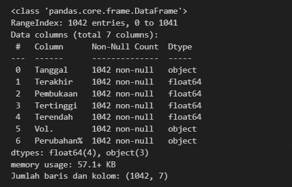
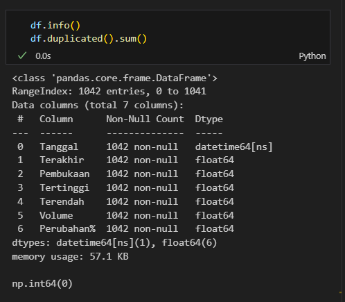
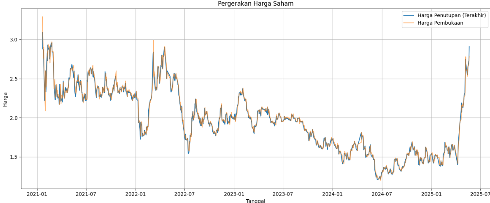
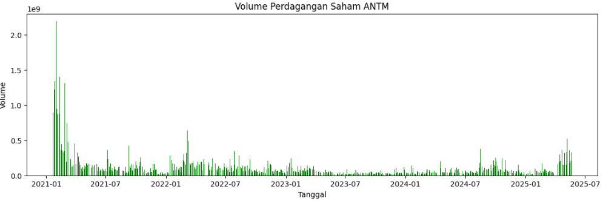
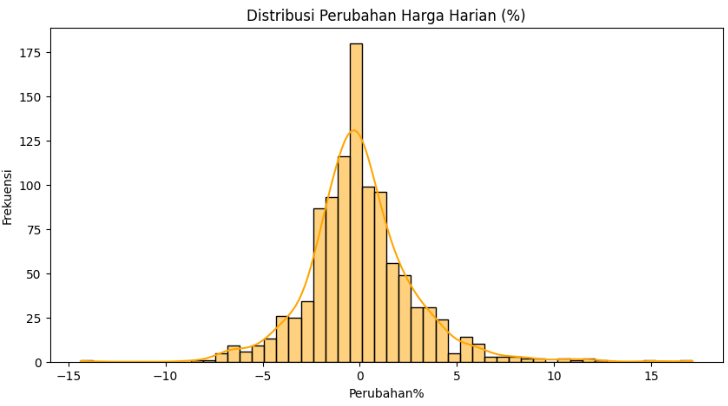
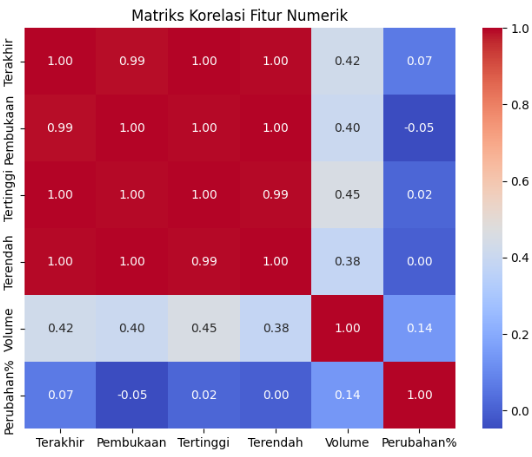
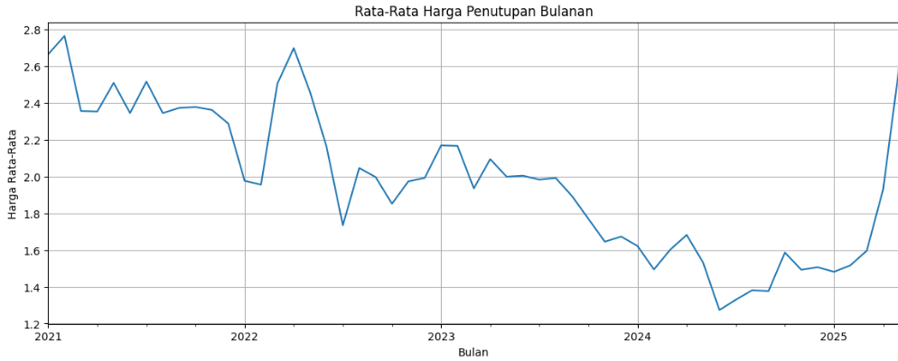
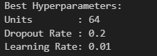
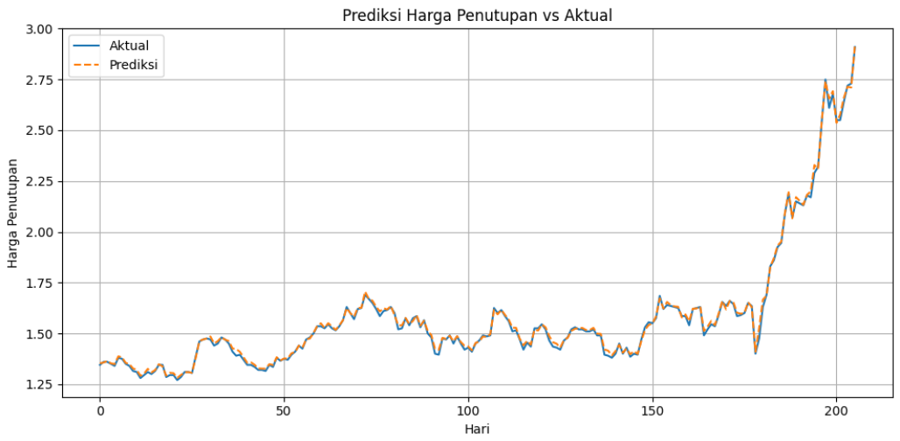

# Laporan Proyek Machine Learning - Ajwa Nabawiya

## Domain Proyek

Pasar modal memainkan peran sentral dalam mendorong pertumbuhan ekonomi melalui mekanisme alokasi modal yang efisien. Investasi saham menjadi salah satu instrumen yang paling diminati oleh investor karena potensi keuntungannya yang tinggi. Namun demikian, pergerakan harga saham sangat fluktuatif dan dipengaruhi oleh berbagai faktor kompleks seperti indikator ekonomi makro, kebijakan pemerintah, situasi geopolitik, serta psikologi pasar. Kompleksitas ini menimbulkan kebutuhan yang tinggi akan pendekatan analitik yang lebih canggih dalam melakukan prediksi harga saham.

PT Aneka Tambang Tbk (ANTM) merupakan salah satu perusahaan pertambangan milik negara yang bergerak di sektor eksplorasi, produksi, dan pemasaran komoditas seperti nikel, emas, dan bauksit. Saham ANTM termasuk salah satu saham aktif di Bursa Efek Indonesia dan sangat dipengaruhi oleh dinamika pasar global, khususnya harga komoditas logam. Oleh karena itu, prediksi harga saham ANTM tidak hanya menarik secara akademik, tetapi juga penting secara praktis bagi investor dan pengambil keputusan finansial. Dalam beberapa dekade terakhir, pendekatan tradisional berbasis statistik seperti ARIMA dan regresi linear telah banyak digunakan untuk prediksi harga saham. Namun, pendekatan tersebut memiliki keterbatasan dalam menangkap pola non-linear dan dependensi jangka panjang dalam data historis. Oleh karena itu, muncul kebutuhan akan metode yang lebih adaptif dan fleksibel, seperti pendekatan machine learning, terutama deep learning.

Salah satu arsitektur deep learning yang relevan untuk masalah ini adalah Long Short-Term Memory (LSTM), yang merupakan jenis Recurrent Neural Network (RNN) yang mampu menangani ketergantungan jangka panjang dan mengatasi permasalahan vanishing gradient. Model LSTM telah terbukti unggul dalam berbagai studi prediksi pasar keuangan. Fischer dan Krauss dalam [1] menunjukkan bahwa LSTM mengungguli regresi linier dan multilayer perceptron dalam memprediksi return saham S&P 500. Selain itu, penelitian oleh Siami-Namini dan Siami Namin [2] menyatakan bahwa LSTM secara signifikan mengalahkan performa ARIMA dalam peramalan data keuangan, dengan penurunan rata-rata kesalahan hingga 87%. Proyek ini bertujuan membangun model prediktif berbasis LSTM untuk memprediksi harga penutupan harian saham ANTM dengan memanfaatkan data historis. Dengan pendekatan ini, diharapkan model dapat mengenali pola-pola tersembunyi dalam pergerakan harga saham dan menghasilkan prediksi yang akurat sebagai dasar pengambilan keputusan investasi.


## Business Understanding

Prediksi harga saham merupakan salah satu tantangan utama dalam dunia keuangan yang bersifat dinamis dan penuh ketidakpastian. Bagi investor, kemampuan untuk memperkirakan pergerakan harga saham secara akurat dapat menjadi keunggulan strategis dalam mengelola risiko dan memaksimalkan keuntungan. PT Aneka Tambang Tbk (ANTM), sebagai perusahaan tambang milik negara yang sahamnya aktif diperdagangkan di bursa, menjadi subjek yang menarik untuk dianalisis secara prediktif. Namun demikian, dalam upaya membangun model prediksi yang efektif, terdapat sejumlah tantangan yang perlu diklarifikasi terlebih dahulu agar proses pemodelan dapat diarahkan secara tepat sasaran. Berikut adalah penjabaran pernyataan masalah yang menjadi dasar proyek ini:

### Problem Statements
- Harga penutupan saham PT Aneka Tambang Tbk (ANTM) sangat fluktuatif dan sulit diprediksi secara akurat menggunakan metode tradisional, sehingga investor menghadapi risiko tinggi dalam pengambilan keputusan investasi.
- Model prediksi yang ada belum dioptimalkan dengan baik sehingga akurasi prediksi masih rendah dan kurang dapat diandalkan untuk mendukung keputusan investasi.
- Proses pencarian kombinasi hyperparameter terbaik untuk model prediksi masih dilakukan secara manual, memakan waktu lama dan tidak menjamin hasil optimal.

Berdasarkan permasalahan di atas, proyek ini dirancang dengan sejumlah tujuan strategis yang selaras dengan kebutuhan analisis pasar saham modern. Tujuan-tujuan tersebut dijabarkan sebagai berikut:

### Goals
- Membangun model prediktif berbasis Long Short-Term Memory (LSTM) yang mampu menangkap pola temporal dalam data harga saham ANTM dan memprediksi harga penutupan harian secara akurat.
- Mengoptimalkan performa model LSTM dengan menggunakan teknik hyperparameter tuning otomatis melalui KerasTuner untuk memperoleh konfigurasi terbaik yang menghasilkan prediksi dengan nilai MAE dan RMSE serendah mungkin, serta koefisien determinasi (R²) mendekati 1.
- Mengurangi waktu dan usaha dalam proses tuning model sekaligus meningkatkan kualitas prediksi melalui pendekatan sistematis dan terukur.

Untuk mewujudkan tujuan tersebut, strategi solusi berikut dirancang agar dapat menjawab permasalahan secara komprehensif dan terukur:

### Solution statements
- Mengimplementasikan model LSTM sebagai baseline model untuk menangkap pola jangka panjang dan dinamika non-linear dalam data time series harga saham ANTM.
- Menggunakan KerasTuner untuk melakukan pencarian otomatis hyperparameter penting seperti jumlah neuron LSTM, jumlah layer, learning rate, dan batch size, sehingga dapat memperoleh kombinasi optimal yang meningkatkan akurasi prediksi.
- Mengevaluasi performa model menggunakan metrik Mean Absolute Error (MAE), Root Mean Squared Error (RMSE), dan Koefisien Determinasi (R²), guna memastikan bahwa model memiliki tingkat kesalahan rendah dan dapat menjelaskan variabilitas data dengan baik.


## Data Understanding
Data yang digunakan dalam proyek ini merupakan data historis harga saham harian PT Aneka Tambang Tbk (ANTM), yang diperoleh dari situs finansial Investing.com(https://id.investing.com/equities/aneka-tambang-historical-data). Dataset mencakup periode Januari 2021 hingga Mei 2025 dan disusun dalam format tabular, yang mencerminkan informasi pasar saham harian seperti harga pembukaan, penutupan, tertinggi, terendah, dan volume transaksi. Data ini menjadi fondasi utama dalam membangun model prediktif berbasis time series karena menggambarkan dinamika pergerakan harga saham dari waktu ke waktu. Dataset diunduh secara manual dan mencakup harga saham harian dari tanggal 21 Januari 2021 hingga 21 Mei 2025 dengan total 1.042 entri data dan 7 kolom fitur.




### Variabel-variabel pada dataset harga saham tersebut adalah sebagai berikut:
- Tanggal: Tanggal pencatatan data.
- Terakhir: Harga penutupan saham pada hari tersebut.
- Pembukaan: Harga pembukaan saham.
- Tertinggi: Harga tertinggi yang dicapai pada hari tersebut.
- Terendah: Harga terendah pada hari tersebut.
- Vol.: Volume transaksi saham.
- Perubahan%: Persentase perubahan harga dari hari sebelumnya.

### Transformasi Data
Data saham yang diperoleh masih mengandung beberapa kolom dengan format yang belum sesuai untuk analisis, seperti tanggal dalam bentuk string dan nilai volume serta persentase perubahan yang belum berbentuk numerik. Oleh karena itu, perlu dilakukan transformasi data agar formatnya sesuai dan data siap untuk dianalisis dan diexplorasi lebih lanjut dengan langkah-langkah sebagai berikut: 

- Data pada kolom Tanggal awalnya dalam bentuk object (string) dan perlu dikonversi ke format datetime agar Konversi dan pengurutan data secara kronologis agar sesuai dengan analisis time series.
- Kolom Vol. awalnya menggunakan notasi seperti 329,77M atau 894,77M, sehingga perlu dikonversi menjadi angka sehingga nilai volume kini berada dalam satuan numerik (float64) dengan satuan lot saham. Nama pada dataset yang awalnya (Vol.) diubah menjadi Volume agar memudahkan dalam memahami data.
- Menghapus tanda persen kolom Perubahan% berisi string dan mengganti koma dengan titik desimal kemudian konversi ke float sehingga siap digunakan sebagai fitur numerik.



Berdasarkan hasil pengecekan, dataset telah berhasil dibersihkan dan ditransformasikan menjadi bentuk yang siap diproses untuk eksplorasi lanjutan atau dimasukkan ke dalam model prediktif. Hal ini memastikan format waktu valid dan urut, data numerik siap distandardisasi dan informasi penting seperti volume dan perubahan harga dapat dianalisis secara akurat. Dataset juga tidak memiliki missing values dan juga tidak memiliki nilai duplikat sehingga siap memasuki tahap Eksplorasi dan analisis. 

### Eksplorasi Awal dan Analisis Data
Sebagai langkah awal dalam proses analisis saham ANTM, dilakukan eksplorasi terhadap tren harga, volume perdagangan, distribusi perubahan harga harian, korelasi antar kolom dan grafik musiman tren bulanan. Tahapan ini bertujuan untuk memahami dinamika historis pergerakan saham serta mengidentifikasi pola atau anomali yang dapat menjadi dasar bagi analisis prediktif selanjutnya.

#### Visualisasi Tren Harga Saham


Grafik di atas menunjukkan pergerakan harga pembukaan dan penutupan saham ANTM selama periode Januari 2021 hingga Mei 2025. Dari visualisasi ini, terlihat bahwa kedua garis—harga pembukaan dan harga penutupan—bergerak sangat berdekatan, menandakan bahwa fluktuasi harga harian relatif stabil dalam jangka pendek. Pada awal tahun 2021, harga saham mengalami lonjakan signifikan, menyentuh level di atas 3,0. Hal ini kemungkinan besar mencerminkan sentimen pasar yang sangat positif atau adanya katalis tertentu seperti kinerja keuangan yang kuat atau kenaikan harga komoditas yang mendukung sektor pertambangan. Namun, memasuki tahun 2022 hingga awal 2023, tren harga cenderung menurun dan bergerak sideways (datar), yang dapat diinterpretasikan sebagai periode konsolidasi atau menurunnya minat investor terhadap saham ini. Penurunan ini berlanjut hingga awal 2024, ketika harga menyentuh titik terendahnya selama periode observasi. Menariknya, sejak pertengahan 2024 hingga pertengahan 2025, terjadi perubahan signifikan dalam tren harga. Harga saham menunjukkan lonjakan tajam secara konsisten, mengindikasikan adanya pergeseran sentimen pasar menjadi lebih optimistis. Tren kenaikan ini dapat menjadi sinyal awal dari fase bullish yang berpotensi berlanjut, terutama jika didukung oleh faktor fundamental seperti peningkatan laba bersih perusahaan, ekspansi bisnis, atau prospek industri yang cerah. Secara keseluruhan, grafik ini memberikan wawasan yang berharga dalam memahami dinamika pergerakan harga saham ANTM dan membantu dalam proses analisis prediktif ke depan.

#### Visualisasi Volume Perdagangan


Gambar di atas menunjukkan visualisasi volume perdagangan saham ANTM dari Januari 2021 hingga Mei 2025. Terlihat adanya lonjakan volume yang sangat signifikan pada awal tahun 2021, yang kemungkinan besar disebabkan oleh sentimen pasar positif atau aksi korporasi penting yang menarik perhatian investor. Volume perdagangan pada periode tersebut mencapai lebih dari 2 miliar saham dalam satu hari, menunjukkan tingginya minat pasar terhadap saham ANTM saat itu. Namun setelah lonjakan tersebut, volume perdagangan mengalami penurunan drastis dan cenderung stabil pada level yang lebih rendah hingga tahun 2025. Meskipun demikian, terdapat beberapa lonjakan kecil yang muncul secara sporadis di tahun-tahun berikutnya, yang dapat mencerminkan reaksi pasar terhadap peristiwa tertentu seperti rilis laporan keuangan atau kebijakan baru perusahaan. Secara keseluruhan, grafik ini memberikan gambaran yang jelas mengenai dinamika minat investor terhadap saham ANTM dari waktu ke waktu, serta menunjukkan bahwa lonjakan volume perdagangan yang tinggi cenderung bersifat sementara dan tidak selalu berkelanjutan.

#### Distribusi Perubahan Persentase Harga


Gambar di atas menunjukkan histogram distribusi perubahan harga harian saham ANTM dalam persentase. Bentuk distribusinya menyerupai distribusi normal (bell-shaped curve) dengan puncak distribusi berada di sekitar angka 0%. Hal ini menunjukkan bahwa sebagian besar perubahan harga harian cenderung kecil dan stabil, berada dalam kisaran sekitar -5% hingga +5%. Kurva distribusi yang cukup simetris mencerminkan tidak adanya bias besar terhadap arah kenaikan atau penurunan ekstrem dalam satu hari perdagangan. Selain itu, grafik ini juga menunjukkan bahwa hanya sedikit data yang tergolong sebagai outlier ekstrem di luar rentang tersebut, menandakan bahwa volatilitas harga harian saham ANTM relatif moderat. Visualisasi ini memberikan gambaran yang berguna bagi investor dan analis dalam menilai risiko pergerakan harga jangka pendek, serta menunjukkan bahwa saham ANTM memiliki karakteristik pergerakan yang cukup stabil dari hari ke hari.

#### Korelasi Antar Kolom



Visualisasi heatmap di atas menunjukkan matriks korelasi antar fitur numerik seperti harga pembukaan (Open), tertinggi (High), terendah (Low), penutupan (Close), volume perdagangan, dan persentase perubahan harga (% Change) pada saham ANTM. Terlihat bahwa terdapat korelasi yang sangat kuat (mendekati 1.0) antara harga pembukaan, tertinggi, terendah, dan penutupan. Hal ini mengindikasikan bahwa keempat variabel tersebut bergerak sangat searah dalam satu hari perdagangan, mencerminkan keterkaitan alami antar harga-harga tersebut. Di sisi lain, volume perdagangan dan persentase perubahan harga memiliki korelasi yang jauh lebih lemah terhadap variabel harga, yang menunjukkan bahwa besarnya volume transaksi tidak secara langsung mempengaruhi arah atau besarnya perubahan harga harian. Temuan ini memberikan wawasan bahwa aktivitas perdagangan (volume) dan fluktuasi harga tidak selalu memiliki hubungan linier yang kuat, sehingga perlu dianalisis secara kontekstual tergantung pada kondisi pasar.

#### Musiman dan Tren Bulanan


Garis tren pada grafik di atas menggambarkan rata-rata harga penutupan saham ANTM untuk setiap bulan selama periode Januari 2021 hingga Mei 2025. Dari visualisasi ini terlihat bahwa harga penutupan mengalami penurunan yang cukup signifikan dari akhir tahun 2021 hingga awal tahun 2024. Penurunan ini bisa jadi mencerminkan tekanan pasar atau penurunan kinerja perusahaan selama periode tersebut. Namun, sejak awal tahun 2024, terjadi pembalikan arah tren dengan kenaikan harga yang konsisten hingga pertengahan tahun 2025. Tren naik ini mengindikasikan adanya potensi pemulihan dalam fundamental perusahaan atau adanya sentimen positif dari pasar, seperti peningkatan kepercayaan investor atau prospek pertumbuhan bisnis yang lebih baik ke depannya.


Berdasarkan hasil ekplorasi, dataset saham ANTM menunjukkan bahwa data harga saham memiliki tren yang bervariasi selama periode pengamatan, dengan fluktuasi harga yang relatif stabil dan volatilitas moderat. Volume perdagangan cenderung menurun setelah lonjakan awal. Korelasi antar fitur harga sangat kuat, sementara volume dan perubahan persentase harga memiliki korelasi yang lebih lemah. Distribusi data juga cukup bersih tanpa outlier ekstrem yang signifikan, sehingga siap untuk analisis lebih lanjut.


## Data Preparation
Pada tahap data preparation, beberapa teknik penting diterapkan secara berurutan untuk memastikan data siap digunakan dalam pemodelan prediksi deret waktu. Berikut ini adalah langkah-langkah yang dilakukan beserta alasan pemilihannya:

1. Feature Engineering

    Pada tahap ini dibuat fitur-fitur baru yang mengandung informasi temporal dari data harga. Teknik yang diterapkan adalah:

    - Lag features: Mengambil nilai harga terakhir pada hari sebelumnya (lag 1), 3 hari sebelumnya (lag 3), dan 5 hari sebelumnya (lag 5). Tujuan pembuatan fitur lag adalah agar model dapat menangkap pengaruh harga masa lalu terhadap harga saat ini. Dengan begitu, model bisa memanfaatkan ketergantungan waktu (temporal dependencies) yang sering terjadi pada data deret   waktu.
        ``` python
        df['Terakhir_lag1'] = df['Terakhir'].shift(1)
        df['Terakhir_lag3'] = df['Terakhir'].shift(3)
        df['Terakhir_lag5'] = df['Terakhir'].shift(5)

    - Moving average features: Menghitung rata-rata harga terakhir selama 3 hari dan 5 hari terakhir. Moving average ini membantu model mengenali tren jangka pendek (3 hari) dan tren jangka menengah (5 hari), sehingga model dapat lebih sensitif terhadap pola perubahan harga yang relevan dalam periode tersebut. Kedua jenis fitur ini sangat penting agar model tidak hanya melihat data pada satu titik waktu, tetapi juga pola historis yang berpengaruh pada prediksi.

        ```python
        df['Terakhir_MA3'] = df['Terakhir'].rolling(window=3).mean()
        df['Terakhir_MA5'] = df['Terakhir'].rolling(window=5).mean()

    - Drop baris dengan nilai NAN akibat shift dan rolling: Operasi shift() pada Lag Features dan rolling() pada Moving Average akan menghasilkan nilai kosong (NaN) pada baris awal (karena data sebelumnya tidak ada), baris ini dihapus agar data siap dipakai untuk modeling tanpa error.

    Dengan menambah fitur lag dan moving average, kita bisa memperkaya data dengan informasi temporal yang penting untuk analisis deret waktu (time series) atau prediksi harga saham, sehingga model bisa lebih akurat memahami pola dan tren harga dari waktu ke waktu.

2. Feature Selection

    Setelah membuat fitur baru, dilakukan seleksi fitur untuk memilih hanya fitur yang relevan dan memberikan kontribusi signifikan terhadap model. Pemilihan fitur ini berdasarkan pengetahuan domain (domain knowledge) dan hasil eksplorasi data (EDA) sehingga fitur yang kurang informatif atau berpotensi menambah noise dapat dihilangkan. Hal ini bertujuan untuk menyederhanakan model, mengurangi kompleksitas, dan meningkatkan performa prediksi dengan fokus pada informasi yang benar-benar penting.

    ```python
    input_features = ['Pembukaan', 'Tertinggi', 'Terendah', 'Volume', 'Perubahan%', 
                  'Terakhir_lag1', 'Terakhir_lag3', 'Terakhir_lag5', 'Terakhir_MA3', 'Terakhir_MA5']

3. Data Splitting

    Dataset kemudian dipisah menjadi data latih (train) dan data uji (test) dengan rasio 80:20. Pemisahan ini dilakukan tanpa pengacakan (no shuffling) karena data merupakan deret waktu (time series), di mana urutan kronologis harus tetap terjaga. Pendekatan ini menjaga keaslian pola waktu agar model dilatih dengan data masa lalu dan diuji pada data masa depan, sehingga evaluasi lebih realistis dan sesuai konteks prediksi deret waktu. Dalam konteks prediksi harga saham, target yang ingin diprediksi biasanya adalah harga penutupan hari ini berdasarkan fitur-fitur lain (misalnya harga sebelumnya, volume, indikator teknikal, dll). Kolom "Terakhir" biasanya adalah nama kolom yang menunjukkan harga penutupan saham pada hari ini (closing price). 

    ```python
    X = df[input_features].values
    y = df['Terakhir'].values  # Target = harga penutupan hari ini

4. Scaling / Normalization

    Data fitur (X) dan target (y) kemudian dinormalisasi ke rentang 0 hingga 1 menggunakan MinMaxScaler. Scaling hanya dilakukan dengan fitting pada data training agar tidak terjadi kebocoran data (data leakage) dari data uji. Normalisasi ini penting agar seluruh fitur berada dalam skala yang sama, sehingga tidak ada fitur yang mendominasi karena skala besar dan membantu model, terutama yang berbasis neural network, untuk belajar lebih cepat dan stabil selama proses pelatihan.

5. Reshape untuk LSTM

    Karena model LSTM membutuhkan input berbentuk tiga dimensi (samples, timesteps, features), data fitur diubah bentuknya menjadi 3D dengan timesteps = 1. Hal ini memungkinkan model untuk memproses input dalam format sekuensial meskipun informasi historis sudah tercermin dalam fitur lag dan moving average. Reshape ini penting agar data kompatibel dengan arsitektur LSTM dan model dapat memahami pola temporal secara tepat dari data harian.

    ```python
    X_train_lstm = X_train_scaled.reshape((X_train_scaled.shape[0], 1, X_train_scaled.shape[1]))
    X_test_lstm = X_test_scaled.reshape((X_test_scaled.shape[0], 1, X_test_scaled.shape[1]))

## Modeling
Pada penelitian ini, metode machine learning yang digunakan untuk menyelesaikan permasalahan prediksi deret waktu adalah Long Short-Term Memory (LSTM). LSTM merupakan jenis Recurrent Neural Network (RNN) yang dirancang khusus untuk mengatasi keterbatasan model RNN konvensional dalam mengingat informasi jangka panjang, sehingga sangat cocok untuk data berurutan seperti deret waktu. LSTM efektif dalam menangkap pola temporal dan hubungan non-linear antar waktu, sehingga sangat sesuai untuk prediksi harga berbasis data historis. Kelebihan utama LSTM adalah kemampuannya dalam menangkap dependensi temporal jangka panjang dan pola non-linear dalam data, sedangkan kekurangannya terletak pada kebutuhan komputasi yang relatif lebih tinggi serta risiko overfitting apabila model tidak diatur dengan baik.

Karena hanya menggunakan satu algoritma utama, proses improvement dilakukan melalui hyperparameter tuning menggunakan Keras Tuner untuk memperoleh konfigurasi model yang optimal. Pendekatan ini dipilih agar pencarian kombinasi hyperparameter dapat dilakukan secara otomatis dan sistematis, menghindari metode coba-coba manual yang tidak efisien dan rawan bias. Dengan demikian, model yang dihasilkan diharapkan memiliki akurasi prediksi yang lebih baik serta stabilitas yang lebih tinggi terhadap data baru.

1. Fungsi Model Builder
    Fungsi build_model dirancang untuk membangun arsitektur model LSTM yang akan diuji oleh Keras Tuner. Fungsi ini menerima parameter hyperparameter (hp) dan mengembalikan model yang telah dikompilasi. Parameter-parameter yang di-tune meliputi:

    - Units pada LSTM layer: Jumlah neuron dipilih dari kandidat [32, 64, 128], yang menentukan kapasitas model dalam mempelajari pola temporal. Pilihan ini dilakukan untuk mencari titik optimal antara underfitting (neuron terlalu sedikit) dan overfitting (neuron terlalu banyak). Units yang lebih besar memungkinkan model menangkap pola kompleks, namun meningkatkan risiko overfitting dan waktu komputasi.
    -Fungsi aktivasi: Fungsi tanh digunakan karena merupakan fungsi aktivasi standar yang efektif untuk RNN dan LSTM dalam menjaga kestabilan gradien.Fungsi aktivasi tanh digunakan karena sifatnya yang simetris dan mampu mengatur sinyal dalam rentang -1 hingga 1, sangat cocok untuk model RNN/LSTM dalam mengelola informasi waktu secara stabil.
    -Dropout rate: Dipilih dari [0.1, 0.2, 0.3] untuk mengurangi risiko overfitting dengan cara menonaktifkan neuron secara acak selama pelatihan. Dropout berfungsi mencegah overfitting dengan secara acak menonaktifkan sejumlah neuron saat training sehingga model tidak terlalu bergantung pada neuron tertentu. Rate yang lebih tinggi memperbesar regularisasi, namun jika terlalu besar dapat mengurangi kapasitas belajar model.
    - Output layer: Terdiri dari satu neuron dengan aktivasi linear, sesuai dengan tugas regresi prediksi harga. Layer output terdiri dari satu neuron dengan fungsi aktivasi linear (tanpa aktivasi), sesuai dengan tujuan regresi untuk memprediksi nilai harga secara kontinu. 
    - Optimizer Adam dengan learning rate yang juga di-tune dari [0.01, 0.001, 0.0001], sehingga pembaruan bobot model dapat berlangsung secara optimal. Optimizer Adam digunakan karena performanya yang baik pada berbagai jenis neural network. Learning rate di-tune dari [0.01, 0.001, 0.0001] untuk menemukan laju pembelajaran yang optimal agar model dapat konvergen dengan cepat tanpa melompati titik minimum loss.
    - Model dikompilasi menggunakan fungsi loss Mean Squared Error (MSE) yang sesuai untuk regresi dan metrik tambahan Mean Absolute Error (MAE) untuk evaluasi performa. Fungsi loss yang digunakan adalah Mean Squared Error (MSE), standar pada masalah regresi untuk mengukur perbedaan kuadrat antara nilai prediksi dan aktual. Sebagai metrik tambahan, Mean Absolute Error (MAE) dipakai untuk interpretasi yang lebih mudah dalam satuan nilai asli.

    ```python
    def build_model(hp):
        model = keras.Sequential()
        # Layer LSTM dengan units yang ditentukan oleh tuner
        model.add(keras.layers.LSTM(units=hp.Choice('units', values=[32, 64, 128]), activation='tanh', input_shape=(X_train_lstm.shape[1], X_train_lstm.shape[2])))
        # Dropout layer untuk regularisasi
        model.add(keras.layers.Dropout(rate=hp.Choice('dropout', values=[0.1, 0.2, 0.3])))
        # Output layer regresi
        model.add(keras.layers.Dense(1))
        # Compile model dengan learning rate yang ditentukan tuner
        model.compile(
            optimizer=keras.optimizers.Adam(hp.Choice('learning_rate', values=[1e-2, 1e-3, 1e-4])), loss='mse', metrics=['mae'])
        return model


2. Proses Hyperparameter Tuning
    Proses tuning dilakukan dengan menggunakan metode Random Search yang dijalankan oleh Keras Tuner. Metode ini memilih kombinasi hyperparameter secara acak dari ruang pencarian yang telah ditentukan, efisien dalam menemukan konfigurasi terbaik tanpa harus menguji semua kemungkinan kombinasi. Konfigurasi utama pada tuner meliputi:

    - Objective: Meminimalkan nilai loss validasi (val_loss) berupa MSE.
    - Max trials: Maksimal 10 kombinasi hyperparameter yang akan dicoba.
    - Executions per trial: Setiap konfigurasi diuji sebanyak satu kali untuk efisiensi.
    - EarlyStopping: Digunakan untuk menghentikan pelatihan lebih awal apabila validasi loss tidak mengalami perbaikan dalam 5 epoch berturut-turut, guna menghindari overfitting.
    - Selama proses pencarian, model dilatih dengan parameter epoch sebanyak 50 dan batch size 32. Metode Random Search mengeksplorasi ruang hyperparameter secara acak namun efektif, kemudian memilih konfigurasi terbaik berdasarkan performa validasi.

    ```python
    tuner = RandomSearch(build_model,objective='val_loss',max_trials=10,  executions_per_trial=1,directory='keras_tuner_logs',project_name='lstm_natam')

    tuner.search(X_train_lstm, y_train_scaled, validation_data=(X_test_lstm, y_test_scaled),epochs=50, batch_size=32,callbacks=[EarlyStopping(monitor='val_loss', patience=5, restore_best_weights=True)],verbose=1)

    Selama proses pencarian, model dilatih dengan parameter standar yaitu 50 epoch dan batch size 32. EarlyStopping juga memastikan pelatihan berhenti pada titik optimal sebelum model mulai overfit.

3. Hasil dan Implementasi Model Optimal
Hasil tuning menunjukkan konfigurasi terbaik pada model LSTM dengan:
    - Units: 64 neuron pada layer LSTM, memberikan keseimbangan antara kompleksitas dan kapasitas belajar.
    - Dropout rate: 0.2, cukup untuk mencegah overfitting tanpa mengurangi kemampuan model secara signifikan.
    - Learning rate: 0.01, memungkinkan optimizer Adam melakukan update bobot dengan langkah optimal sehingga proses training berjalan cepat dan stabil.

    

Model dengan konfigurasi ini kemudian dilatih ulang menggunakan keseluruhan data training untuk memaksimalkan performa prediksi sebelum dilakukan evaluasi akhir.


## Evaluation

Pada tahap evaluasi model prediksi harga saham ini, digunakan tiga metrik utama untuk mengukur performa model, yaitu Mean Absolute Error (MAE), Root Mean Squared Error (RMSE), dan Koefisien Determinasi (R²). Pemilihan metrik ini disesuaikan dengan konteks permasalahan regresi, di mana tujuan utama adalah meminimalkan selisih antara nilai prediksi dan nilai aktual secara numerik.

### Hasil Evaluasi Model
Setelah dilakukan inverse transform terhadap hasil prediksi dan data aktual, didapatkan hasil evaluasi sebagai berikut:

- MAE sebesar 0.0103, yang berarti rata-rata kesalahan absolut model dalam memprediksi harga saham hanya sekitar 0.0103 satuan harga. Nilai ini menunjukkan model menghasilkan prediksi yang sangat mendekati harga aktual, sehingga sangat cocok digunakan dalam pengambilan keputusan investasi harian yang membutuhkan akurasi tinggi.
- RMSE sebesar 0.0148, mengindikasikan model tidak hanya akurat secara rata-rata, tetapi juga memiliki konsistensi tinggi dalam prediksi dengan penalti rendah terhadap kesalahan besar. Hal ini menunjukkan model mampu menghindari prediksi yang jauh meleset dari nilai sebenarnya.
- sR² sebesar 0.9977, nilai yang sangat mendekati 1, menunjukkan bahwa hampir seluruh variasi harga saham dapat dijelaskan oleh model. Dengan kata lain, model berhasil menangkap pola dan tren dalam data secara sangat efektif.

Berdasarkan ketiga metrik evaluasi tersebut, model LSTM yang dikembangkan mampu memberikan prediksi harga penutupan saham dengan kesalahan yang sangat kecil dan tingkat akurasi yang sangat tinggi. Hal ini menunjukkan bahwa pendekatan modeling dan proses tuning hyperparameter yang diterapkan berhasil menghasilkan model prediksi yang optimal dan dapat diandalkan untuk analisis deret waktu pada harga saham PT ANTAM.

### Proses Tuning Hyperparameter
Penggunaan KerasTuner untuk pencarian otomatis hyperparameter seperti jumlah neuron LSTM, jumlah layer, learning rate, dan batch size berhasil meningkatkan performa model secara signifikan dibandingkan metode manual yang sebelumnya memakan waktu lama dan hasilnya kurang optimal. Pendekatan ini membantu memperoleh konfigurasi model terbaik secara sistematis dan efisien.

### Visualisasi Hasil Prediksi Vs Aktual


Berdasarkan visualisasi grafik “Prediksi Harga Penutupan vs Aktual”, dapat disimpulkan bahwa model prediktif yang digunakan memiliki performa yang sangat baik secara visual. Hal ini terlihat dari garis prediksi (berwarna oranye putus-putus) yang sangat mendekati garis aktual (berwarna biru), menunjukkan bahwa model mampu menangkap pola pergerakan harga secara akurat. Model juga berhasil mengikuti tren utama, termasuk lonjakan harga yang tajam di sekitar hari ke-180 hingga 200, yang menunjukkan kemampuan model dalam mendeteksi perubahan tren harga. Selain itu, tidak tampak adanya deviasi besar antara prediksi dan nilai aktual sepanjang periode waktu yang diamati, sehingga kesalahan prediksi (error) dapat dikatakan relatif rendah dan konsisten.

Adapun sumbu horizontal (sumbu X) yang ditandai dengan angka dari 0 hingga lebih dari 200 menunjukkan urutan hari dalam data uji (bukan tanggal sebenarnya), dengan asumsi bahwa satu unit merepresentasikan satu hari perdagangan. Misalnya, angka 0 menunjukkan hari pertama dalam data uji, angka 100 adalah hari ke-100, dan seterusnya. Oleh karena itu, grafik ini menggambarkan kinerja model prediksi selama lebih dari 200 hari berturut-turut, di mana prediksi model terlihat konsisten mengikuti pergerakan harga aktual sepanjang periode tersebut. Dengan demikian, model ini layak digunakan untuk keperluan peramalan harga dalam jangka pendek hingga menengah, selama tren harga tidak mengalami perubahan yang sangat ekstrem atau tiba-tiba.


### Penjelasan Cara Kerja Metrik Evaluasi
1. Mean Absolute Error (MAE)
MAE mengukur rata-rata dari selisih mutlak antara nilai yang diprediksi model dengan nilai sebenarnya. Metrik ini menunjukkan seberapa besar kesalahan rata-rata yang dilakukan oleh model dalam satuan yang sama dengan data asli. MAE mudah diinterpretasikan dan memberikan gambaran langsung tentang besarnya error rata-rata tanpa memperberat pengaruh kesalahan besar. Semakin kecil nilai MAE, semakin akurat model dalam membuat prediksi.

2. Root Mean Squared Error (RMSE)
RMSE mengukur akar dari rata-rata kuadrat selisih prediksi dan nilai sebenarnya. Metrik ini memberikan bobot lebih besar pada kesalahan yang besar, sehingga jika model membuat kesalahan besar, nilai RMSE akan meningkat secara signifikan. RMSE berguna untuk menilai konsistensi prediksi model, di mana nilai yang lebih kecil menunjukkan prediksi yang lebih stabil dan dapat diandalkan. Nilai RMSE yang rendah menunjukkan bahwa model mampu membuat prediksi yang konsisten dan stabil, terutama jika kesalahan besar perlu diminimalkan.

3. Koefisien Determinasi (R²)
R² menunjukkan seberapa baik model dapat menjelaskan variasi data asli. Nilai R² berkisar antara 0 sampai 1, di mana nilai yang lebih dekat ke 1 berarti model sangat baik dalam menangkap pola dan variasi dalam data, sehingga prediksi yang dihasilkan sangat mendekati nilai aktual.R² memberikan gambaran seberapa baik model dalam merepresentasikan data dibandingkan dengan menggunakan nilai rata-rata sederhana.

### Kesimpulan Evaluasi
Berdasarkan hasil evaluasi numerik dan visual, model LSTM yang dikembangkan memenuhi tujuan bisnis untuk menghasilkan prediksi harga penutupan saham PT Aneka Tambang Tbk (ANTM) dengan tingkat kesalahan yang sangat rendah dan akurasi yang sangat tinggi. Model ini siap digunakan sebagai alat bantu prediksi harga dalam jangka pendek hingga menengah, memberikan nilai tambah strategis bagi investor dalam mengelola risiko dan mengambil keputusan investasi secara lebih tepat.


## Referensi:

[1] T. Fischer and C. Krauss, "Deep learning with long short-term memory networks for financial market predictions," European Journal of Operational Research, vol. 270, no. 2, pp. 654–669, 2018. [Online]. Available: https://doi.org/10.1016/j.ejor.2017.11.054

[2] S. Siami-Namini and A. Siami Namin, "Forecasting Economics and Financial Time Series: ARIMA vs. LSTM," arXiv preprint arXiv:1803.06386, 2018. [Online]. Available: https://arxiv.org/abs/1803.06386

